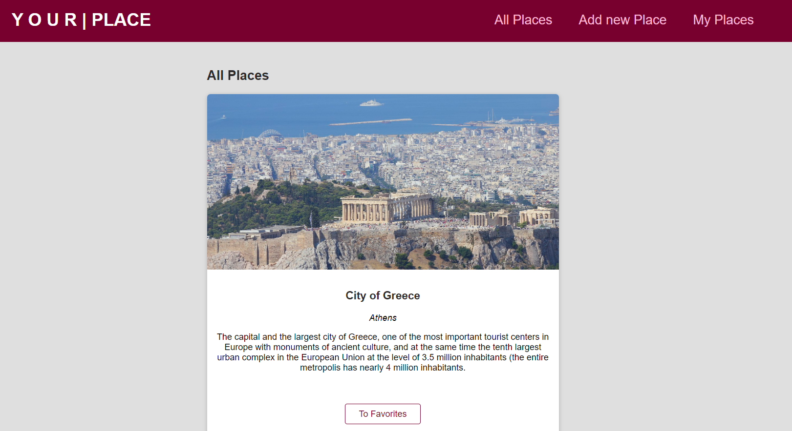
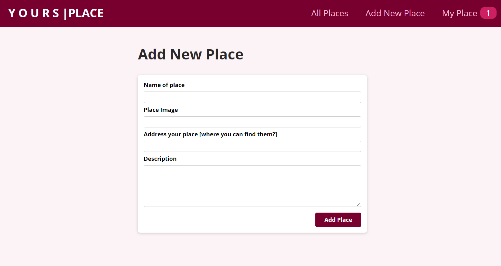

# Your Places
React project | Your places 

## It's a simple React project where you can add your place that you have visited or that you liked.
## In this React app i used:
### - Routing
### - Hooks
### - React Context
### - styles
### - ... and many components

## To check this project please clone or download:
### npm install
### npm start
